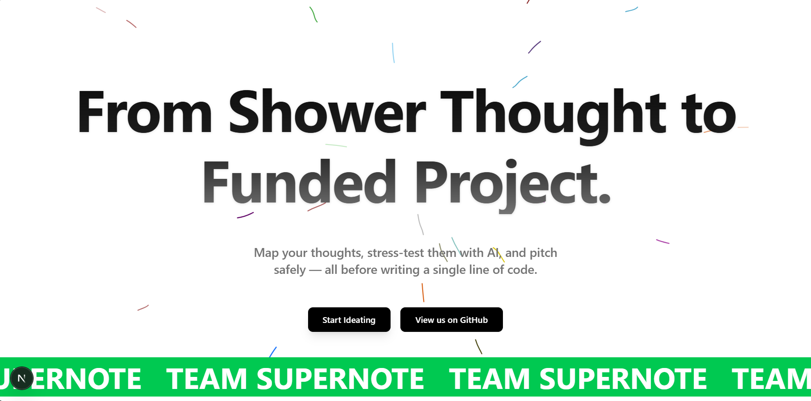
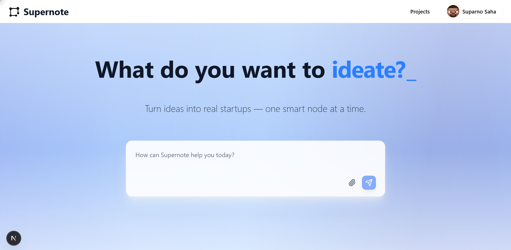
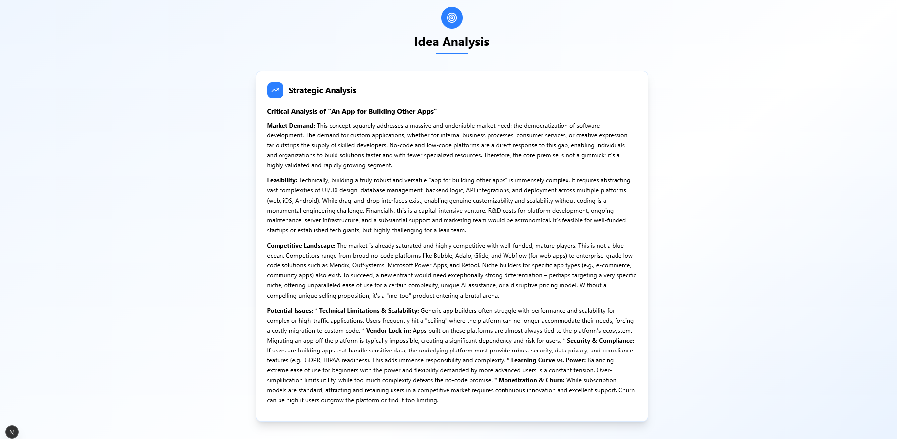
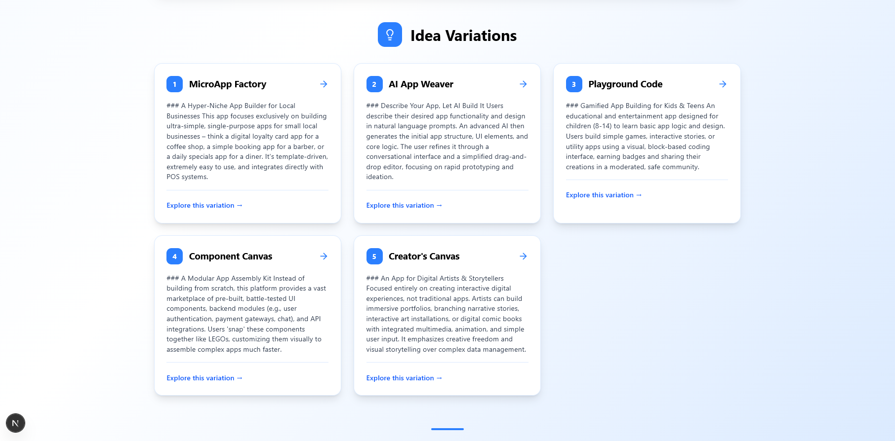
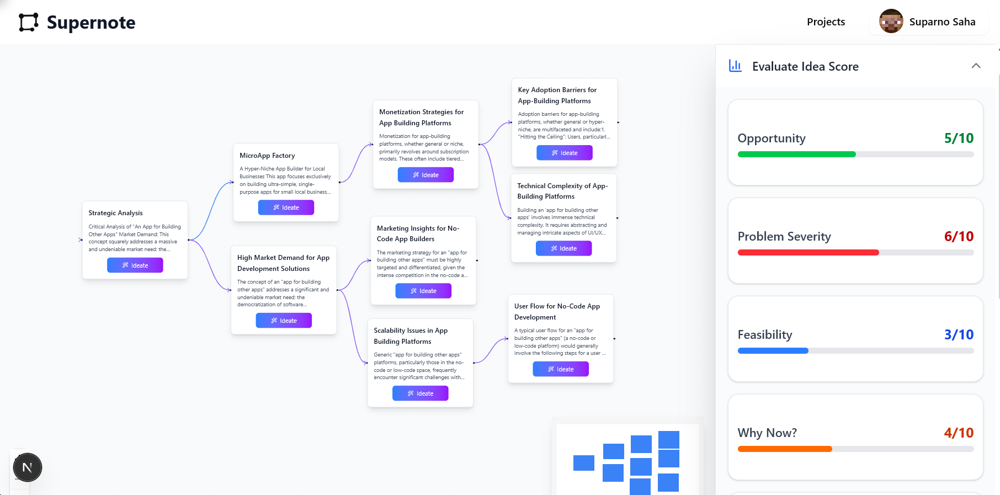
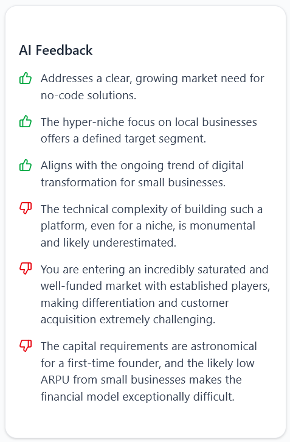
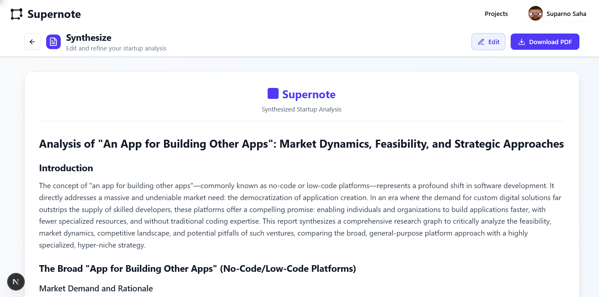
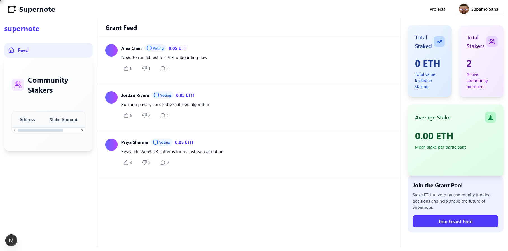

# Supernote

Supernote is an AI-powered ideation platform that helps users turn raw startup ideas into structured, validated, and even funded projects—visually and intelligently.

---

## 🧠 Overview

Start with a simple prompt. Supernote guides you through the core dimensions of startup-building (market research, monetization, scalability, technical complexity, differentiation, etc.) using AI, visualized as a node-based graph. Dive into each node, get community feedback, and optionally request funding from a shared ETH pool. Finally, synthesize your entire journey into an editable Markdown document you can export as PDF.

---

## ✨ Key Features

- **Graph-based ideation flow** with AI-driven node suggestions  
- **Node-level insights**: scalability, market research, monetization, marketing, technical complexity, differentiation  
- **Community validation feed** for targeted feedback  
- **Grant system**: stake ETH to join the pool, vote on proposals, auto-disburse approved grants  
- **Editable synthesis page**: live Markdown editor + PDF export  
- **AI integration**: Langchain orchestration + Gemini for generative tasks

---

## 🛠 Tech Stack

### Frontend
- **Next.js**  
- **React Flow**  
- **TailwindCSS**  
- **shadcn/ui**

### Backend
- **Node.js** + **Express**  
- **MongoDB**  
- **Civic Auth**

### GenAI
- **Langchain + Gemini API**

### Web3 & Smart Contracts
- **Solidity**  
- **Foundry**  
- **Contract Address:** `0xD2b8B4C20C0Dc6A0fF74d4a38d373291FA49E2E3`

---

## ⚙️ Installation

### Frontend
```bash
cd frontend
npm install
npm run dev
````

### Backend

```bash
cd backend
npm install
npm run dev
```

---

## 📁 Environment Variables

Create a `.env` in your `backend/` directory with:

```dotenv
MONGO_PASS=your_mongo_password
MONGO_URI=your_mongo_connection_string
PORT=5000
JWT_SECRET=your_jwt_secret_key
GOOGLE_API_KEY=your_google_api_key
NODE_ENV=development
CIVIC_CLIENT_ID=your_civic_client_id
FRONTEND_URL=http://localhost:3000
NEXT_PUBLIC_BACKEND_URL=http://localhost:5000
```

---

## 🚀 Workflow / Usage

1. **Landing Page** (`/landing`) → click “Start Ideating”
2. **Auth** (optional) → signup/login to save & fund
3. **Starting** (`/starting`) → enter your first idea prompt
4. **Graph View** (`/graph/:id`) → build out nodes manually or via AI
5. **Idea Detail** (`/idea/:nodeId`) → view/edit AI insights, click “Validate”
6. **Feed** (`/feed`) → post censored insight for community feedback or grant request
7. **Funding** → stakeholders vote, approved grants auto-disburse
8. **Synthesize** (`/synthesize`) → edit generated Markdown, export as PDF

---

## 🖼️ Screenshots

<p align="center">
  
  
</p>

<p align="center">
  
  
</p>

<p align="center">
  
  
</p>

<p align="center">
  
  
</p>

<p align="center">
  
  
</p>

---

## 👥 Team & Hackathon Details

* **Built at:** Hack4Bengal 4.0 by team "git gud"
* **Team Members:**
  * [Suparno Saha](github.com/letsbecool9792)
  * [Pritam Das](github.com/frank06n)
  * [Sagnik Goswami](github.com/SagnikGos)
  * [Arko Roy](github.com/arkoroy05)

---

> Crafted with caffeine, chaos, and a single prompt at 3 AM.

